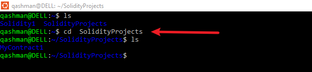

# linux-practice-project
We will be implementing some linux commands

## sudo  command

which is knows as super user do command which is used for administrative privilages to a certain user to manipulate root file and folders.

sudo command we used the following syntax `sudo ap upgrade`

## pwd command

## cd command

